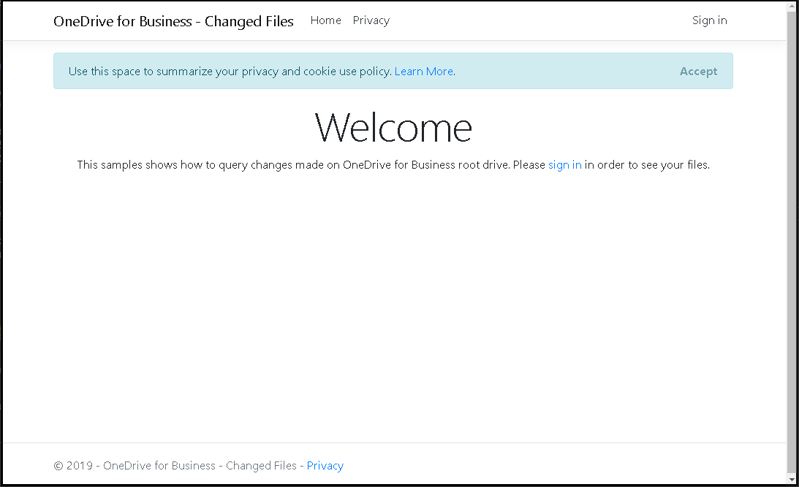

# OneDrive for Business - track changes for a Drive
This sample show how use the [delta API](https://docs.microsoft.com/en-us/graph/api/driveitem-delta) in order to track changes to a drive and its children over time.

## Prerequisites

To use the sample you need the following:

- Visual Studio 2017 or 2019 [with .NET Core 2.2 SDK](https://www.microsoft.com/net/download/core) installed on your development computer.
- Either a [work or school account](https://dev.office.com/devprogram). (You don't need to be an administrator of the tenant.)
- The application ID and key from the application that you [register on the App Registration Portal](#register-the-app).

## Register the app

1. Navigate to the [Azure AD Portal](https://portal.azure.com). Login using a **personal account** (aka: Microsoft Account) or **Work or School Account** with permissions to create app registrations.

   > **Note:** If you do not have permissions to create app registrations contact your Azure AD domain administrators.

2. Click **Azure Active Directory** from the left-hand navigation menu.

3. Click **App registrations** from the current blade navigation pane.

4. Click **New registration** from the current blade content.

5. On the **Register an application** page, specify the following values:

   - **Name** = [Desired app name]
   - **Supported account types** = [Choose the value that applies to your needs]
   - **Redirect URI**
     - Type (dropdown) = Web
     - Value = `https://localhost:44329/signin-oidc`

   > **Note:** Ensure that the Redirect URI value is unique within your domain. This value can be changed at a later time and does not need to point to a hosted URI. If the example URI above is already used please choose a unique value.

   1. Under **Advanced settings**, set the value of the **Logout URL** to `https://localhost:44329/Account/SignOut` and set the flag **ID Token**.
   2. Copy the **Redirect URI** as you will need it later.

6. Once the app is created, copy the **Application (client) ID** and **Directory (tenant) ID** from the overview page and store it temporarily as you will need both later.

7. Click **Certificates & secrets** from the current blade navigation pane.

   1. Click **New client secret**.
   2. On the **Add a client secret** dialog, specify the following values:

      - **Description** = MyAppSecret1
      - **Expires** = In 1 year

   3. Click **Add**.

   4. After the screen has updated with the newly created client secret copy the **VALUE** of the client secret and store it temporarily as you will need it later.

      > **Important:** This secret string is never shown again, so make sure you copy it now.
      > In production apps you should always use certificates as your application secrets, but for this sample we will use a simple shared secret password.

8. Click **Authentication** from the current blade navigation pane.
   1. Select 'ID tokens'
9. Click **API permissions** from the current blade navigation pane.

   1. Click **Add a permission** from the current blade content.
   2. On the **Request API permissions** panel select **Microsoft Graph**.

   3. Select **Delegated permissions**.
   4. In the "Select permissions" search box type "User".
   5. Select **openid**, **offline_access**, **Files.Read.All**.

   6. Click **Add permissions** at the bottom of flyout.

   > **Note:** Microsoft recommends that you explicitly list all delegated permissions when registering your app. While the incremental and dynamic consent capabilities of the v2 endpoint make this step optional, failing to do so can negatively impact admin consent.

## Configure and run the sample

1. Download or clone the OneDrive samples for ASP.NET Core.

2. Open the **AspnetCore-Changed-Files.sln** sample file in Visual Studio 2017 or 2019.

3. In Solution Explorer, open the **appsettings.json** file in the root directory of the project.

   a. For the **AppId** key, replace `ENTER_YOUR_APP_ID` with the application ID of your registered application.

   b. For the **AppSecret** key, replace `ENTER_YOUR_SECRET` with the password of your registered application. Note that in production apps you should always use certificates as your application secrets, but for this sample we will use a simple shared secret password.

4. Press F5 to build and run the sample. This will restore NuGet package dependencies and open the app.

   > If you see any errors while installing packages, make sure the local path where you placed the solution is not too long/deep. Moving the solution closer to the root of your drive resolves this issue.

5. Sign in with your work or school account and grant the requested permissions.

6. You should see the list of your recent files.

7. Change one or more files into you OneDrive for Business personal storage.

8. Press _Show changed files_ button in order to see the list of the changed files.