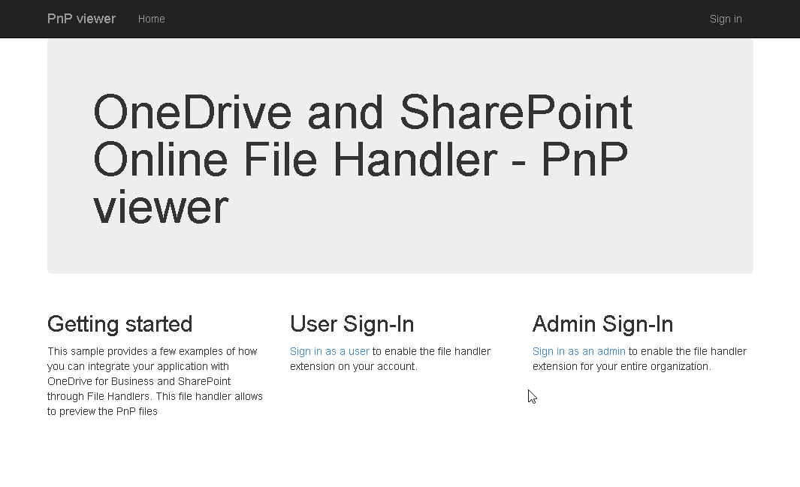

# ASP.NET Core - C# - PnP Files Handler

## Summary
This project provides a sample implementation of a file handler 2.0 for Microsoft Office 365 and it is built using ASP.NET Core. The file handler allows viewing PnP files with the .pnp file extension. [SharePoint Patterns and Practices](https://aka.ms/SharePointPnP) (PnP) is an open-source initiatives related to SharePoint development and the .pnp file is an OpenXML package, which contains templates and automations that you can easily apply to any SharePoint site or tenant.

## Solution

Solution|Author(s)
--------|---------
aspnet-file-handler|Paolo Pialorsi (MCM, MVP, [PiaSys.com](https://piasys.com), [@PaoloPia](https://twitter.com/PaoloPia))

## Version history

Version|Date|Comments
-------|----|--------
1.0.0|November 12, 2018|Initial release

## Disclaimer

**THIS CODE IS PROVIDED *AS IS* WITHOUT WARRANTY OF ANY KIND, EITHER EXPRESS OR IMPLIED, INCLUDING ANY IMPLIED WARRANTIES OF FITNESS FOR A PARTICULAR PURPOSE, MERCHANTABILITY, OR NON-INFRINGEMENT.**

## Getting Started

To get started with the sample, you need to complete the following actions:

1. Register a new application with Azure Active Directory, generate an app password (client secret), and provide a redirect URI for the application.
2. Register the file handler extensions as an add-in for your application in Azure Active Directory.
3. Run the sample project and sign-in with your Office 365 account, accept the consent prompt so the file handler is registered for your account.
4. Navigate to OneDrive for Business or a SharePoint document library and allow file handlers to load.
5. Click Preview on a PnP file in order to see a summary of the templates defined in the .pnp file.

### Register a new application

To register a new application with Azure Active Directory, log into the [Azure Portal](https://portal.azure.com).
File handler apps **cannot** be registered through the new [Application Registration Portal](https://apps.dev.microsoft.com) since that portal creates converged applications which are not currently compatible with file handlers.

After logging into the Azure Portal, the following steps will allow you to register your file handler application:

1. Navigate to the **Azure Active Directory** module.
2. Select **App registrations** and click **New application registration**.
   1. Type the name of your file handler application.
   2. Ensure **Application Type** is set to **Web app / API**
   3. Enter a sign-on URL for your application, for this sample use `https://localhost:44344`.
   4. Click **Create** to create the app.
3. After the app has been successfully created, select the app from the list of applications. It should be at the bottom of the list. Click on **View all applications** if you don't see your application.
4. Copy the **Application ID** for the app you registered and paste it into the [web.config](./PnpFileHandler/web.config) file on the line: `<add key="ida:ClientId" value="[application id here]" /     }`
5. Make a note of the **Object ID** for this application, since you will need it later to register the file handler manifest.
6. Configure the application settings for this sample, by clicking on the **Settings** item and:
   1. Select **Properties** and set **Multi-tenanted** to yes if you plan to use your handler from another organization and click **Save**.
   2. Select **Reply URLs** and ensure that `https://localhost:44344` is listed.
   3. Select **Required permissions** and then **Add**.
   4. Click **Select an API** and then choose **Microsoft Graph** and click **Select**.
   5. Find the delegated permission **Have full access to all files user can access** and check the box next to it, then click **Select**, and then **Done**.
   6. Select **Keys** and generate a new application key by entering a description for the key, selecting a duration, and then click **Save**. Copy the value of the displayed key since it will only be displayed once.
      * Paste the value of the key you generated into the [web.config](./PnpFileHandler/web.config) file of this project, inside the value for the line: `<add key="ida:ClientSecret" value="[application key here]" /`.

### Register the file handler manifest

After registering your app with Azure Active Directory, you can upload the file handler manifest information into the application. You need to create an access token with admin privileges for the same organization where you created the application, then edit the addins list.

For detailed instructions on how to upload the file handler manifest, see [Registering file handlers](https://docs.microsoft.com/en-us/onedrive/developer/file-handlers/register-manually).

The file handler manifest for the sample file is available in the [addin.json](./addin.json) file in this project.

### Register an Azure Storage instance

The sample uses an Azure Storage table to cache user and token information.
To successfully run the sample, you must provide an Azure Storage connection string in the [web.config](./PnpFileHandler/web.config) `<add key="StorageConnectionString" value="[AzureStorageConnectionString]" />`

To create a new storage instance and copy the connection string:

1. Open the [Azure Portal](https://portal.azure.com) in your browser. You must have a valid Azure Subscription or trial subscription.
2. Select **Storage Accounts** and then click **Add**.
3. Name the storage account, leaving the defaults as they are. You will also need to create a new resource group and provide a name.
4. Click **Create** to provision the storage account.
5. After the storage account has finished provisioning, select it from the list of storage accounts. Click on the **Access Keys** tab, and copy the connection string for **key1**.
6. Paste the connection string value over the `[AzureStorageConnectionString]` in Web.config.

### Run the project and sign-in

Once your project is registered and configured, you're ready to run it. Press F5 to launch the project in the debugger.
The file handler project will load in your default browser and be ready for you to sign in.
Sign-in to the file handler project, and authorize the application to have access to the data in your OneDrive.

You **must** follow this step first in order to make the file handler available for the user, who can be in the same or in another organization.

### Navigate to OneDrive and use the PnP file handler

Once you have authorized the file handler to have access, the file handler will be available in OneDrive and SharePoint.
After signing-in to the app, click the "Try it in OneDrive" button to launch your OneDrive.
Due to service caches, it may take a few minutes before your file handler shows up in OneDrive.
You may need to close your browser and open it again before the file handler will be activated. You can also try to reset the cache following [these instructions](https://docs.microsoft.com/en-us/onedrive/developer/file-handlers/reset-cache?view=odsp-graph-online)

### Preview the PnP file 

In order to try the handler you need a .pnp file in your OneDrive folder. You can find a sample to copy from the [Starter Kit](https://github.com/SharePoint/sp-starter-kit/tree/master/provisioning). Find the uploaded file and click on it (or click *Preview* on the context menu).
This will launch the file handler in preview mode. You will see some information related to the .pnp file.

## Related references

For more information check out:
- [Microsoft Authentication Library](https://github.com/AzureAD/microsoft-authentication-library-for-dotnet)
- [Microsoft Graph](https://graph.microsoft.com)
- [SharePoint Patterns and Practices](https://github.com/SharePoint/PnP)

## License

See [License](LICENSE.txt) for the license agreement covering this sample code.