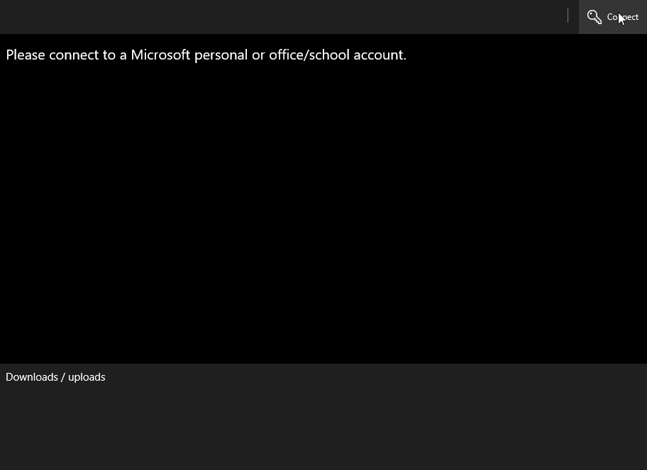

# UWP - C# - OneDrive Files Explorer

## Summary
This project provides a sample UWP (Universal Windows Platform) implementation of a files explorer for Microsoft OneDrive with a Personal or Work/School account.

This sample illustrates how to use OneDrive APIs through [Microsoft.Identity.Client](https://www.nuget.org/packages/Microsoft.Identity.Client) and [Microsoft.Graph](https://www.nuget.org/packages/Microsoft.Graph) NuGet packages in order to authenticate the user and browse her/his files.

## Solution

Solution|Author(s)
--------|---------
uwp-files-explorer|Paolo Pialorsi (MCM, MVP, [PiaSys.com](https://piasys.com), [@PaoloPia](https://twitter.com/PaoloPia))

## Version history

Version|Date|Comments
-------|----|--------
1.0.0|November 12, 2018|Initial release

## Disclaimer

**THIS CODE IS PROVIDED *AS IS* WITHOUT WARRANTY OF ANY KIND, EITHER EXPRESS OR IMPLIED, INCLUDING ANY IMPLIED WARRANTIES OF FITNESS FOR A PARTICULAR PURPOSE, MERCHANTABILITY, OR NON-INFRINGEMENT.**

## Features implemented
The sample application implements the following features:
- Authentication and authorization access to OneDrive
- Files and folders browsing
- Download and upload files



## Getting Started

To get started with the sample, you need to complete the following actions:

1. Register a new application into Microsoft Application Registration Portal.
2. Configure the project with your Client id.
3. Run the sample project and sign-in account and accept the consent prompt.
4. Navigate to user me drive, download or upload a file.

### Register and configure the application

1. Sign into the [App Registration Portal](https://apps.dev.microsoft.com/) using either your personal or work or school account.  
2. Select **Add an app**.  
3. Enter a name for the app, and select **Create application**. The registration page displays, listing the properties of your app.  
4. Under **Platforms**, select **Add platform**.  
5. Select **Native Application**.  
6. Copy the Client Id (App Id) value to the clipboard.
7. Select **Save**.  
8. Open the the solution and then open the [App.xaml](FilesExplorer/App.xaml) file: paste the Client Id into the String resource.
```
<Application.Resources>
  <x:String x:Key="ClientId">paste client id here</x:String>
</Application.Resources>
```
9. Run the sample pressing F5.

## Related references

For more information about Microsoft Authentication Library, check out the [library project](https://github.com/AzureAD/microsoft-authentication-library-for-dotnet).

For more information about Microsoft Graph API, see [Microsoft Graph](https://graph.microsoft.com).

## License

See [License](LICENSE.txt) for the license agreement covering this sample code.